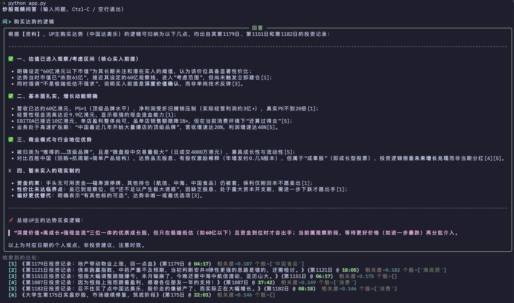

# JiucaiTracker —— 炒股视频问答（RAG）

把 ~972 个"实盘日记"音频（`.m4a`）转成可检索、**可溯源**的知识库，
回答"某只个股/板块的买卖逻辑"等问题。范式是 **RAG，不做微调**——
答案均带出处（视频标题 + 时间戳），检索不到就明说"资料未提及"，不编造。

完整设计见 `~/.claude/plans/1200-20-rag-iterative-pearl.md`。

## 数据规模

| 维度 | 数值 |
|------|------|
| 音频文件数 | 972 个 `.m4a` |
| 总音频时长 | ~280 小时 |
| 转写文件（`data/transcripts/`） | 972 个 JSON，合计 47 MB |
| 转写总字数（段落级） | ~592 万字，均每视频约 6,100 字 |
| Chunk 文件（`data/chunks/`） | 972 个 JSON，合计 29 MB |
| Chunk 总数 | 15,785 块 |
| Chunk 总字数（含块间重叠） | ~722 万字 |
| 向量库（Qdrant 本地） | 211 MB |
| 股票/板块词典（`lexicon.txt`） | 44 条 |
| ASR 热词表（`hotwords.txt`） | 46 条 |

## 架构：ASR 本地、其余上云

| 环节 | 用什么 | 在哪 | 费用 |
|------|--------|------|------|
| ASR 转写 | mlx-whisper `large-v3-turbo` | 本地 Apple GPU | 免费 |
| 向量化 | `text-embedding-v3` | 阿里云百炼 | 极低（建库约几元） |
| 重排 | `gte-rerank-v2` | 阿里云百炼 | 低 |
| 生成 | `qwen-plus` | 阿里云百炼 | 每问几厘~几分 |
| 向量库 | Qdrant | 本地 Docker | 免费 |

云端三件套**共用一个 `DASHSCOPE_API_KEY`**。本地 ASR 不需要任何 key。

## 流水线

```
audios/*.m4a
  └─(1) scan_audio    扫描+解析文件名(标题/第N日)         → data/manifest.json
  └─(2) transcribe    本地 mlx-whisper 转写(带时间戳)      → data/transcripts/*.json
  └─(3) build_chunks  清洗+抽个股+分段                     → data/chunks/*.json
  └─(4) index         text-embedding-v3 向量化 → Qdrant
  └─(5) app           检索(语义)+gte-rerank 重排+qwen 带引用生成
  └─(6) eval          Ragas 评估 faithfulness/相关性
```

## 前置要求

- **macOS + Apple Silicon**（mlx-whisper 走 M 芯片 GPU；Intel/其它平台见下方"切换 ASR"）
- **Python 3.10+**、**ffmpeg**（`brew install ffmpeg`）、**Docker**（跑 Qdrant）
- **阿里云百炼 API Key**：https://bailian.console.aliyun.com → API-KEY

## 启动步骤

```bash
# 0. 准备音频：把音频目录软链到 audios/（或直接放 .m4a 进去）
ln -s /path/to/your/audio_folder audios

# 1. 依赖
python3 -m venv .venv && .venv/bin/python -m ensurepip
.venv/bin/python -m pip install -r requirements.txt
brew install ffmpeg

# 2. 配置 key
cp .env.example .env        # 编辑，填入 DASHSCOPE_API_KEY

# 3. 起本地 Qdrant
docker run -d -p 6333:6333 -v $(pwd)/qdrant_storage:/qdrant/storage qdrant/qdrant

# 4. 试点：先用最近 10 天验证全链路（--limit 取最近 N 天）
.venv/bin/python -m pipeline.scan_audio --limit 10
.venv/bin/python -m pipeline.transcribe       # 本地转写，首次自动下模型(~1.6GB)
.venv/bin/python -m pipeline.build_chunks
.venv/bin/python -m pipeline.index            # 起需要 DASHSCOPE_API_KEY
.venv/bin/python app.py                        # 交互问答

# 5. 单次提问 / 调试
.venv/bin/python app.py -q "白云山的买卖逻辑是什么？"
.venv/bin/python app.py --debug -q "..."       # 打印每次模型调用与完整 prompt

# 6. 满意后跑全量（去掉 --limit），重复 2→5 的转写~建库
.venv/bin/python -m pipeline.scan_audio
.venv/bin/python -m pipeline.transcribe
.venv/bin/python -m pipeline.build_chunks
.venv/bin/python -m pipeline.index
```

> 各阶段**幂等**：transcribe/index 会跳过已处理项（index 用稳定 id 覆盖）。
> 想强制重转：`transcribe --overwrite`。

## 参数设置（config.yaml）

密钥只从环境变量读（见 `.env.example`），其余都在 `config.yaml`：

```yaml
asr:
  provider: mlx_whisper        # mlx_whisper(Apple GPU) | faster_whisper(CPU) | dashscope | openai
  language: zh
  mlx_whisper:
    model: mlx-community/whisper-large-v3-turbo  # 质量优先换 whisper-large-v3-mlx
  faster_whisper:              # 无 Apple GPU 时用（纯 CPU）
    model: medium              # tiny/base/small/medium/large-v3；中文建议 medium 起步
    device: cpu                # CTranslate2 暂不支持 MPS
    compute_type: int8
    vad_filter: true
    beam_size: 5

embedding:
  model: text-embedding-v3     # 必须和建库时一致，别单独改
  dim: 1024
  batch_size: 10               # text-embedding-v3 兼容接口单次上限

rerank:
  format: dashscope            # dashscope | siliconflow
  model: gte-rerank-v2

llm:
  model: qwen-plus             # 质量优先 qwen-max；省钱 qwen-turbo
  temperature: 0.2

vector_store:
  url: http://localhost:6333
  collection: jiucai_chunks

chunking:
  max_chars: 450               # 每块最大字数（影响检索粒度）
  overlap_chars: 80            # 块间重叠，避免论述被切断
  min_chars: 80                # 过短的块丢弃

entity:
  lexicon: data/lexicon.txt    # 个股/板块词典；命中即记入 chunk 的 stocks，支持按股票过滤聚合
  match_stock_code: true       # 额外正则抓 A股6位/港股代码

retrieval:
  top_k: 20                    # 语义召回数量
  top_n: 6                     # 重排后送入 LLM 的数量
```

**需要手动维护的数据文件：**
- `data/hotwords.txt`：转写热词（个股名/术语/频道名），纠正 ASR 专名识别。
- `data/lexicon.txt`：实体抽取词典；不全也不影响检索（退化为纯语义），只影响"按单只股票精准聚合"的覆盖面。

## Debug 模式

打印 embedding / 检索 / 重排 / LLM 每次调用与完整 prompt（输出到 stderr）：

```bash
.venv/bin/python app.py --debug -q "..."   # 单次
JIUCAI_DEBUG=1 .venv/bin/python -m pipeline.index   # 环境变量，对所有脚本生效
```

## 清空 / 重置

```bash
# 清空并重建向量库（用现有 chunks）
.venv/bin/python -m pipeline.index --recreate

# 只清空向量库
.venv/bin/python -c "from pipeline.common import load_config; from qdrant_client import QdrantClient; c=load_config(); QdrantClient(url=c['vector_store']['url']).delete_collection(c['vector_store']['collection'])"

# 连中间产物一起清（音频软链不受影响）
rm -rf data/transcripts/* data/chunks/* data/manifest.json

# 彻底重置 Qdrant 服务+数据
docker rm -f $(docker ps -aq --filter ancestor=qdrant/qdrant); rm -rf qdrant_storage
```

## 切换 ASR / 供应商

改 `config.yaml` 即可，代码已留好分支：
- **无 Apple GPU** → `asr.provider: faster_whisper`（纯 CPU，慢但跨平台）。
- **云端转写** → `dashscope`（阿里云 Paraformer，需 OSS，填 `asr.oss` + `OSS_*` 环境变量）
  或 `openai`（whisper-1，需 `OPENAI_API_KEY`，>25MB 自动切片）。
- **向量/重排换回 SiliconFlow** → 改 `embedding`/`rerank` 段的 `base_url`/`model`/`format`，填 `EMBED_API_KEY`。
- **Paraformer 热词** → `python -m pipeline.make_vocabulary` 生成 `vocabulary_id` 回填 `config.yaml`。

## 关键约定

- **音频源**：`audios/` 是软链，不入库；产物在 `data/`（已 gitignore）。
- **可溯源**：每个 chunk 带 `{video_id, title, day_index, start_ts, end_ts, stocks}`，回答引用标题+时间戳。
- **个股聚合**：阶段3 抽取每段提到的个股/板块作 metadata，问单只股票时按 `stocks` 过滤、跨视频聚合；命中太少自动放宽为纯语义。
- **密钥**：只从环境变量读，绝不写进 `config.yaml`。

## Showcase
